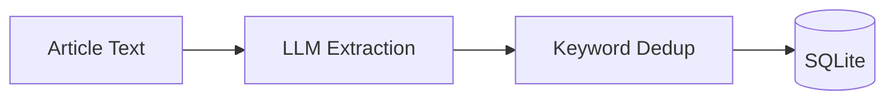

# WordTrace

A news article keyword analysis and co-occurrence network visualization tool.

## Overview

WordTrace acquires news articles, extracts keywords using LLM, and presents analysis with graph visualization.

### Key Features

- **News Acquisition**: RSS/API-based article discovery
- **Keyword Extraction**: LLM-powered entity and concept identification (via OpenRouter/Gemini 2.5 Flash)
- **Article Categorization**: Automatic classification into Politics, Business, Sports, etc.
- **Smart Deduplication**: Gemini API embedding-based similarity matching

### Keyword Categories

| Type | Categories |
| --- | --- |
| **Entities** | People, Places, Organizations |
| **Concepts** | Geopolitics, Economic Crisis, Innovation |

### Article Categories

Politics, Business, Sports, Entertainment, Technology, Health & Science, World

## Architecture

```
wordtrace/
├── backend/
│   ├── app/                    # FastAPI application
│   └── modules/                # Core business logic
│       ├── articles/           # RSS & Retrieval
│       ├── pipeline/           # Orchestration
│       ├── llm/                # Extraction
│       ├── keywords/           # Deduplication
│       └── graph/              # Neo4j Client (WIP)
└── frontend/                   # React visualization (TBD)
```

### Data Flow



## Tech Stack

| Layer | Technology |
| --- | --- |
| Backend | Python 3.12+, FastAPI, uv |
| LLM | OpenRouter API (Gemini 2.5 Flash) |
| Embeddings | Gemini API (text-embedding-004) |
| Keywords DB | SQLite3 |
| Frontend | React, react-force-graph (TBD) |

## Quick Start

```bash
# Backend
cd backend
uv sync
cp .env.example .env  # Configure API keys
uv run uvicorn app.main:app --reload
```

## Documentation

- [Architecture](docs/ARCHITECTURE.md) - System design details
- [Development](docs/DEVELOPMENT.md) - Setup and contribution guide

## To Do

### On existing code
- Fix: URL normalization is weak (stripping query params)
- Fix: Date handling should be UTC-aware and ISO 8601 enforced
- Refactor: Orchestrator leaks SQL (move update logic to articles_db)
- Config: Externalize hardcoded values (User Agent, Model Name)

### Roadmap
- Integration pipeline with Neo4j
- Configure news acquisition in detail, including selecting sources
- Work on proper backend API (routers, etc.)
- Create Frontend
