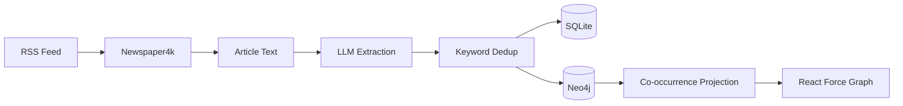

# WordTrace

A news article keyword analysis and co-occurrence network visualization tool.

## Overview

WordTrace acquires news articles, extracts and intelligently deduplicates keywords using LLM, stores article-keyword relationships in a Neo4j graph database, and provides an interactive visualization of keyword co-occurrence networks.

### Key Features

- 📰 **News Acquisition**: RSS/API-based article discovery + Newspaper4k extraction
- 🔑 **Keyword Extraction**: LLM-powered entity & concept identification (via OpenRouter/Gemini 2.5 Flash)
- 🏷️ **Article Categorization**: Automatic classification into Politics, Business, Sports, etc.
- 🔗 **Smart Deduplication**: Gemini API embedding-based similarity matching
- 🕸️ **Graph Storage**: Neo4j-backed article-keyword relationships designed for GraphRAG
- 📊 **Co-occurrence Visualization**: Interactive React Force Graph with category filtering

### Keyword Categories

| Type         | Categories                               |
| ------------ | ---------------------------------------- |
| **Entities** | People, Places, Organizations            |
| **Concepts** | Geopolitics, Economic Crisis, Innovation |

### Article Categories

Politics · Business · Sports · Entertainment · Technology · Health & Science · World

## Architecture

```
wordtrace/
├── backend/
│   ├── app/                    # FastAPI application
│   │   ├── main.py             # App entry point
│   │   └── routers/            # API route handlers
│   └── modules/                # Core business logic
│       ├── llm/                # Keyword extraction
│       ├── keywords/           # Deduplication + SQLite
│       ├── news/               # Article acquisition
│       └── graph/              # Neo4j operations
└── frontend/                   # React visualization (TBD)
```

### Data Flow



### Graph Schema

**Source Graph** (backend storage):

```
(:Article)-[:HAS_KEYWORD]->(:Keyword)
```

**Visualization Graph** (projected for frontend):

```
(:Keyword)-[:CO_OCCURS_WITH {weight}]->(:Keyword)
```

## Tech Stack

| Layer       | Technology                        |
| ----------- | --------------------------------- |
| Backend     | Python 3.12+, FastAPI, uv         |
| LLM         | OpenRouter API (Gemini 2.5 Flash) |
| Embeddings  | Gemini API (text-embedding-004)   |
| Graph DB    | Neo4j                             |
| Keywords DB | SQLite3                           |
| News        | Newspaper4k, feedparser           |
| Frontend    | React, react-force-graph          |

## Quick Start

```bash
# Backend
cd backend
uv sync
cp .env.example .env  # Configure API keys
uv run uvicorn app.main:app --reload

# Frontend (TBD)
cd frontend
npm install
npm run dev
```

## Documentation

- [Architecture](docs/ARCHITECTURE.md) - System design details
- [Development](docs/DEVELOPMENT.md) - Setup & contribution guide

## License

MIT
