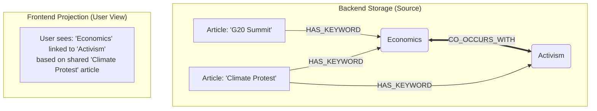

# WordTrace Architecture

## System Overview

WordTrace is designed as a modular system with clear separation between:

- **API Layer** (`app/`) - FastAPI routes and request handling
- **Business Logic** (`modules/`) - Core functionality modules
- **Storage** - SQLite (keywords) + Neo4j (graph)

## Component Architecture

```mermaid
    subgraph "Backend (FastAPI & Pipeline)"
        subgraph "app/"
            MAIN[main.py]
            R1[routers/keywords.py]
        end

        subgraph "modules/"
            subgraph "pipeline/"
                ORCH[orchestrator.py]
            end

            subgraph "articles/"
                RSS[rss_fetcher.py]
                PB[paperboy.py]
                ADB[articles_db.py]
            end

            subgraph "llm/"
                LLM1[llm_client.py]
                LLM2[extractor.py]
            end

            subgraph "keywords/"
                KW1[keywords_db.py]
                KW2[deduplicator.py]
            end
        end
    end

    subgraph "Storage"
        SQLITE[(SQLite)]
        NEO4J[("Neo4j (WIP)")]
    end

    subgraph "External"
        OPENROUTER[OpenRouter API]
        RSS_FEEDS((RSS Feeds))
    end

    RSS_FEEDS --> RSS
    RSS --> ADB
    PB --> ADB
    ORCH --> RSS & PB
    ORCH --> LLM2
    ADB --> ORCH
    
    LLM2 --> LLM1
    LLM1 --> OPENROUTER
    
    ORCH --> KW2
    KW2 --> KW1
    KW1 --> SQLITE
    
    MAIN --> R1
    R1 --> KW1 & KW2
```

## Data Models

### Keyword

```python
class StoredKeyword(BaseModel):
    id: str                    # UUID
    canonical_name: str        # Standardized form
    keyword_type: str         # "entity" or "concept"
    category: str              # Category value
    embedding: list[float]     # Gemini API embedding for similarity
    aliases: list[str]         # Original forms seen
```

### Extraction

```python
class ExtractedKeyword(BaseModel):
    name: str
    canonical_name: str
    keyword_type: str
    category: str

class ExtractionResult(BaseModel):
    article_category: ArticleCategory
    keywords: list[ExtractedKeyword]
```

## Graph Architecture Vision

### Core Philosophy: The "Big Beautiful Graph"

We maintain a **Single Unified Graph** as the source of truth. Instead of fragmenting data into separate silos (e.g., separate graphs for "Sports" or "Politics"), we keep all articles and keywords in one interconnected space.

**Why?** The ultimate goal is **Serendipity**. By allowing a "Politics" article and a "Technology" article to share the same "Artificial Intelligence" keyword node, we reveal hidden connections between seemingly disparate domains. This is the "Big Beautiful Graph" that grows richer over time.

### Dual-Track Structure

We distinguish between how data is **stored** (Backend) and how it is **experienced** (Frontend).

#### 1. Backend: The Source of Truth (Persistence)
*   **Structure**: `Article -> HAS_KEYWORD -> Keyword`
*   **Role**: The permanent, high-fidelity archive of every acquired news piece.
*   **Data Retention**: Articles are kept for a set meaningful period (e.g., 3 months) to ensure relevance while maintaining a rich historical context for analysis.

#### 2. Frontend: The Dynamic Projection (Visualization)
*   **Structure**: `Keyword <-> CO_OCCURS_WITH <-> Keyword`
*   **Role**: A real-time, context-aware view generated on demand.
*   **User Experience**: 
    *   **Dynamic Filtering**: The user selects a context (e.g., "Last 7 Days" + "Business" Category).
    *   **Live Projection**: The system instantly morphs the graph to show only connections meaningful within that specific slice of time and topic.
    *   **Drill-Down**: Clicking an edge (connection) reveals the specific articles that created it, grounding the abstract web in concrete news stories.

### Visual Flow



## Keyword Deduplication

### Strategy

1. **Extract** keywords from article using LLM
2. **Generate** embedding for each keyword
3. **Compare** against existing keywords using cosine similarity
4. **Merge** if similarity > threshold (0.85), else create new
5. **Canonicalize** using LLM assistance when needed

### Example Flow

```
Input: "President Trump"
  ↓
Embedding: [0.12, 0.45, ...]
  ↓
Compare: cosine_similarity with existing keywords
  ↓
Match found: "Donald Trump" (similarity: 0.92)
  ↓
Result: Link to existing "Donald Trump" keyword
```

## Environment Configuration

```bash
# .env
OPENROUTER_API_KEY=sk-...
SIMILARITY_THRESHOLD=0.85
```
