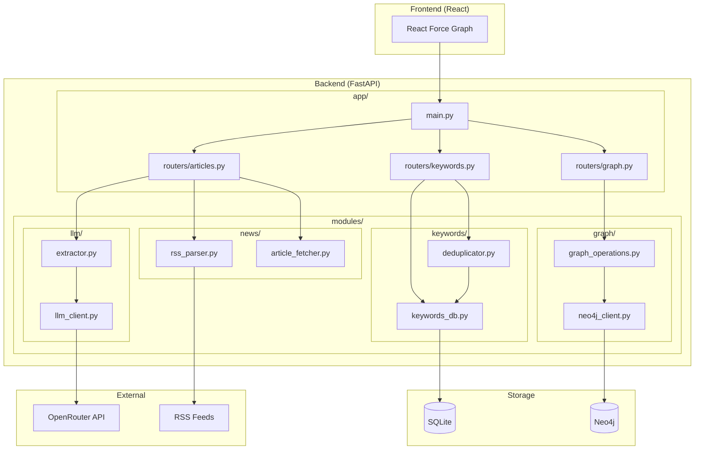

# WordTrace Architecture

## System Overview

WordTrace is designed as a modular system with clear separation between:

- **API Layer** (`app/`) - FastAPI routes and request handling
- **Business Logic** (`modules/`) - Core functionality modules
- **Storage** - SQLite (keywords) + Neo4j (graph)

## Component Architecture



## Data Models

### Keyword

```python
class Keyword(BaseModel):
    id: str                    # UUID
    canonical_name: str        # Standardized form
    type: Literal["entity", "concept"]
    category: str              # People, Places, Organizations, etc.
    embedding: list[float]     # Gemini API embedding for similarity
    aliases: list[str]         # Original forms seen
```

### Article

```python
class Article(BaseModel):
    id: str                    # UUID
    url: str
    title: str
    text: str
    category: str              # Politics, Business, Sports, Entertainment, Technology, Health & Science, World
    published_at: datetime
    source: str
    keywords: list[str]        # Keyword IDs
```

## Graph Schema

### Source Graph (Neo4j)

Stores the full relationship model for GraphRAG operations:

```cypher
// Nodes
(:Article {
    id: string,
    url: string,
    title: string,
    category: string,
    published_at: datetime,
    source: string
})

(:Keyword {
    id: string,
    canonical_name: string,
    type: string,
    category: string
})

// Relationships
(:Article)-[:HAS_KEYWORD {
    relevance_score: float,
    extracted_at: datetime
}]->(:Keyword)
```

### Projected Graph (for visualization)

Generated on-demand from source graph:

```cypher
// Nodes (same as source)
(:Keyword)

// Relationships (computed)
(:Keyword)-[:CO_OCCURS_WITH {
    weight: integer,          // Co-occurrence count
    articles: [string]        // Article IDs where they co-occur
}]->(:Keyword)
```

**Projection Query:**

```cypher
MATCH (k1:Keyword)<-[:HAS_KEYWORD]-(a:Article)-[:HAS_KEYWORD]->(k2:Keyword)
WHERE id(k1) < id(k2)
WITH k1, k2, COUNT(DISTINCT a) AS weight, COLLECT(DISTINCT a.id) AS articles
RETURN k1, k2, weight, articles
```

## Keyword Deduplication

### Strategy

1. **Extract** keywords from article using LLM
2. **Generate** embedding for each keyword
3. **Compare** against existing keywords using cosine similarity
4. **Merge** if similarity > threshold (0.85), else create new
5. **Canonicalize** using LLM assistance when needed

### Example Flow

```
Input: "President Trump"
  ↓
Embedding: [0.12, 0.45, ...]
  ↓
Compare: cosine_similarity with existing keywords
  ↓
Match found: "Donald Trump" (similarity: 0.92)
  ↓
Result: Link to existing "Donald Trump" keyword
```

## Environment Configuration

```bash
# .env
OPENROUTER_API_KEY=sk-...
NEO4J_URI=bolt://localhost:7687
NEO4J_USER=neo4j
NEO4J_PASSWORD=password
SIMILARITY_THRESHOLD=0.85
```
