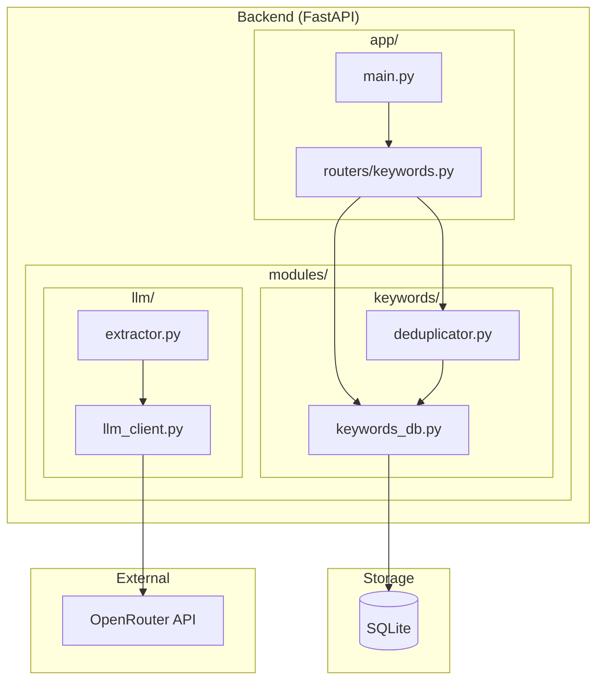

# WordTrace Architecture

## System Overview

WordTrace is designed as a modular system with clear separation between:

- **API Layer** (`app/`) - FastAPI routes and request handling
- **Business Logic** (`modules/`) - Core functionality modules
- **Storage** - SQLite (keywords) + Neo4j (graph)

## Component Architecture



## Data Models

### Keyword

```python
class StoredKeyword(BaseModel):
    id: str                    # UUID
    canonical_name: str        # Standardized form
    keyword_type: str         # "entity" or "concept"
    category: str              # Category value
    embedding: list[float]     # Gemini API embedding for similarity
    aliases: list[str]         # Original forms seen
```

### Extraction

```python
class ExtractedKeyword(BaseModel):
    name: str
    canonical_name: str
    keyword_type: str
    category: str

class ExtractionResult(BaseModel):
    article_category: ArticleCategory
    keywords: list[ExtractedKeyword]
```

## Keyword Deduplication

### Strategy

1. **Extract** keywords from article using LLM
2. **Generate** embedding for each keyword
3. **Compare** against existing keywords using cosine similarity
4. **Merge** if similarity > threshold (0.85), else create new
5. **Canonicalize** using LLM assistance when needed

### Example Flow

```
Input: "President Trump"
  ↓
Embedding: [0.12, 0.45, ...]
  ↓
Compare: cosine_similarity with existing keywords
  ↓
Match found: "Donald Trump" (similarity: 0.92)
  ↓
Result: Link to existing "Donald Trump" keyword
```

## Environment Configuration

```bash
# .env
OPENROUTER_API_KEY=sk-...
SIMILARITY_THRESHOLD=0.85
```
